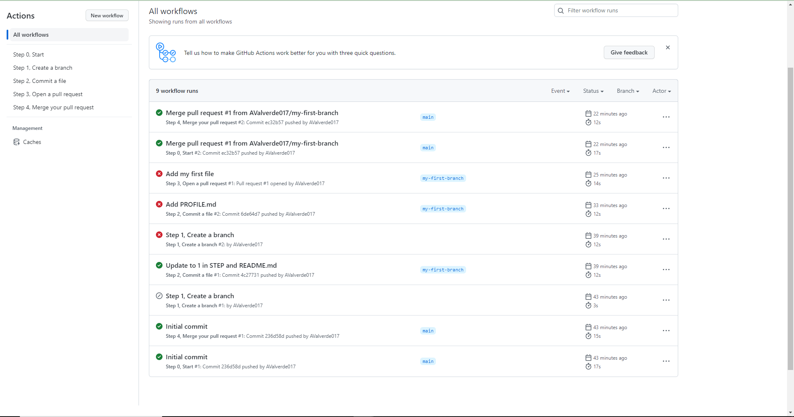

# Busca en Wikipedia e indica:
1. Qué es GitHub y su relación con Git  
- GitHub es una forja (plataforma de desarrollo colaborativo) para alojar proyectos utilizando el sistema de control de versiones Git. Se utiliza principalmente para la creación de código fuente de programas de ordenador.

2. Compañía dueña de GitHub  
- Microsoft

3. Qué es una rama en el código (branch of the code)
- Una rama, en el ámbito del control de versiones, es una copia de los archivos de un programa que se mantiene aislada del directorio principal (que también es considerado una rama) pero que sigue estando dentro del proyecto
4. Qué es una nueva característica en el código (new feature)
- Los nuevos buscadores y la forma de prensentar los apartados en la pantalla de perfil de usuario
5. Qué es un pull request 
- Hace referencia a un modelo de desarrollo de software mayormente usado en GitHub, donde diferentes desarrolladores que trabajan en un proyecto abierto y compartido hacen sus propias contirbuciones compartiendo un repositorio principal y realizando cambios después de las peticiones (pull request) echas por los usuarios integradores.
6. Qué es un merge
 -  En control de versiones, la integración es una operación fundamental que concilia multiples cambios hechos a una colección de versiones controladas de archivos. Habitualmente, es necesaria cuando un archivo ha sido modificado en dos ramas independientes y subsecuentemente integradas. El resultado es una colección única de archivos que contienen ambos grupos de cambios.

7. Qué es un issue
- Los issues o propuestas, permiten seguir la pista del trabajo realizado. Se utilizan para dar feedback, sugerir cambios, ideas o corregir errores. 

8.  Qué es una mención y qué implica
- Puede mencionar a una persona o equipo en GitHub, Para ello, escriba @ junto con su nombre de usuario o equipo. Esto activará una notificación y llamará su atención hacia la conversación. Las personas también recibirán una notificación si editas un comentario para mencionar su nombre de usuario o el nombre del equipo.

9.  Qué es una etiqueta (label) y por qué su uso
    
-  Las etiquetas son referencias que apuntan a puntos concretos en el historial de Git. Generalmente, el etiquetado se usa para capturar un punto en el historial que se utiliza para una publicación de versión marcada. Una etiqueta es como una rama que no cambia. A diferencia de las ramas, las etiquetas, tras crearse, no tienen más historial de confirmaciones.

10.  Qué son las notificaciones. Indica las tres opciones de notificaciones
-  Las notificaciones son actualizaciones que recibes para alguna actividad específica a la cual te hayas suscrito.
-  Opciones de notificaciones:

   - La bandeja de entrada de notificaciones d ela interfaz web de GitHub.
   - La bandeja de notificaciones en GitHub Mobile, que se sincroniza con la de GitHub
   - Un cliente de correo electrónico que utiliza una dirección de correo electrónico verficiada, la cual también se sincroniza con la bandeja de entrada de notificaciones en Github y Github Mobile.

11.   Qué son GitHub Pages
- GitHub Pages es un servicio de alojamiento de sitio estático que toma archivos HTML, CSS y JavaScript directamente desde un repositorio en GitHub, opcionalmente ejecuta los archivos a través de un proceso de complilación y publica un sitio web.
12.   Qué es GitHub Flow
- GitHub Flow se define como un sistema de flujo de trabajo que se centra en los procesos de ramificación y que permite realizar implementaciones regulares en los proyectos, contribuyendo así a garantizar la entrega continua. Esta herramienta se basa en ramas o branches que forman parte del flujo de trabajo diario.

# Entrega un pantallazo que demuestre que lo has finalizado y responde a las siguientes preguntas:

